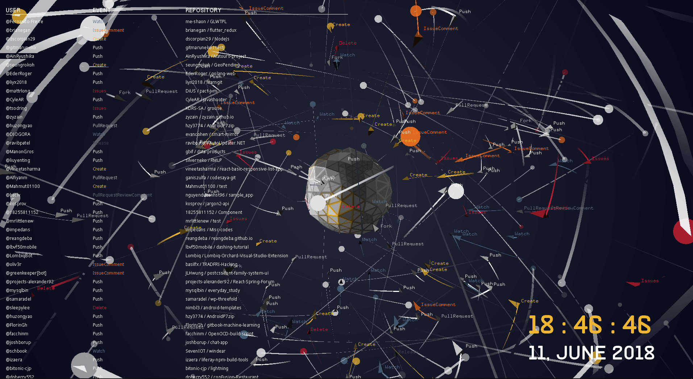
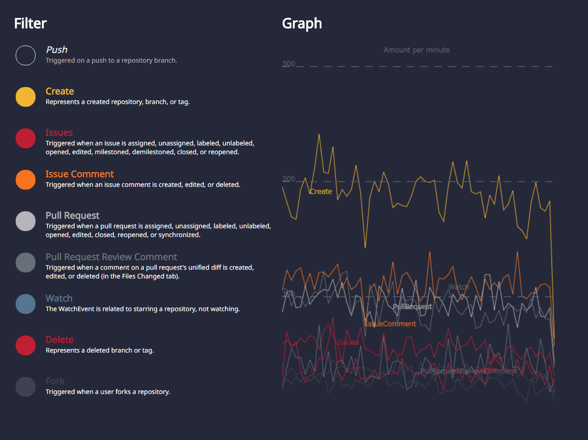

# GHSatellite

PC View: visualizing user activities on public repositories in real-time


Tablet View: provides the filter switches of visualizer and the graph of events' amount per minute


## About
### GH Satellite:

**EN:** "Contributions" made by users in the world on Github through Source Code are visualized in real-time by satellite orbits as a metaphor. The satellite appears continuously and each one has user information. The arrows indicate that various event operations such as creation of a public repository, push, issue report, etc. have been performed, and converge in the center sphere. Color varies depending on the type of event. The satellite group that continually appears for 24 hours directly represents the worldwide "contribution" through Source Code.

The data source is real-time information of the public repository that can be obtained by [Events](https://api.github.com/events) of [GitHub API](https://developer.github.com/v3/?). Theses softwares are developed with OSS libraries such like data acquisition and processing by Node.js and three dimensional visualization by openFrameworks. The source code of this work is also released on GitHub.

**JP:** 今現在、世界のGithub上のユーザーがSource Codeを通じて行う貢献 "contribution" が、衛星軌道のメタファによって表現される。衛星は継続的に現れ、ひとつひとつはユーザ情報を持っている。発せられる矢印は公開レポジトリの作成やPush、Issue報告など各種イベント操作が行われたことを表し、中央の球体の中に収斂していく。色はイベントの種類によって異なる。24時間絶え間なく現れる衛生群は、 Source Codeを介して行われる世界中の"貢献"を直接的にあらわしている。

データ・ソースは、[GitHub API](https://developer.github.com/v3/?) の [Events](https://api.github.com/events) で取得できる公開レポジトリのリアルタイム情報である。データの取得と処理をNode.js、3次元可視化プログラムをopenFrameworksで制作し、OSSを用いて開発されている。本作のSource CodeもまたGitHub上で公開されている。

## Dependency
Tested on
* OS
    * Windows 10 Home ver.1803
    * macOS High Sierra Version 10.13.5
* Node.js v8.11.1
* openFrameworks 0.10.0
    * master banch on github at [this commit](https://github.com/openframeworks/openFrameworks/tree/c274c7fb51b4ae0552cd4cdb00475458aeeb610a)
    * build with
        * Visual Studio 2017(v141)
        * Xcode Version 9.4
* font:
    * [noto-sans-normal-light](https://www.google.com/get/noto/) &copy; Google
    * [track](http://www.fontfabric.com/track-free-font/) &copy; [Gumpita Rahayu](https://www.behance.net/gumpita)

## Bulid
### node Server
1. get github api access token in [here](https://github.com/settings/tokens)
    * paste your token in [line 8](https://github.com/nama-gatsuo/GHSatellite/blob/master/node/src/server/ApiHandler.js#L8) in `node/src/server/ApiHandler.js`
2. install node module and build js file
```sh
$ cd node
$ npm install
$ gulp build
```

### openFrameworks
1. open by "[Projector Generator](https://github.com/openframeworks/openFrameworks/blob/c274c7fb51b4ae0552cd4cdb00475458aeeb610a/docs/projectgenerator.md)" and do **Update** this directory.
2. build **Release** version with IDE

## Run
Double clicking `start.bat`(Windows) / `start.command`(macOS) then automatically node server and oF app will start.
* access with HTTP to PORT 8080 then can get controller(for tablet view).
